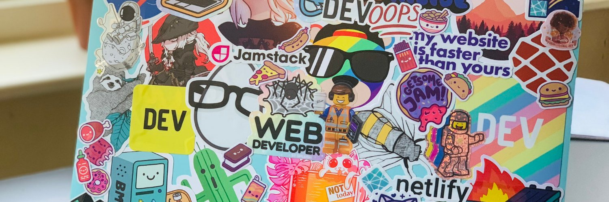

</img>

## How to reach me 📫:

    
    
    
    

 

---

## Summary

I am Rohit Dalal a <b>FullStack, Golang Developer & DevOps</b> professional with ten years of experience working in startups and tech firms. <b>Expertise includes creating scalable APIs, designing microservices, and overseeing cloud infrastructure</b>. Skilled in using AI coding tools like GitHub Copilot and Cursor to boost development speed, improve code quality, and troubleshoot effectively. <b>Known for optimising costs, resolving complex issues, and delivering reliable, production-ready systems.</b>

---

## Skills

- **Backend:** Node.js, Golang, TypeScript, PHP, ShellScript
- **Frontend:** JavaScript, React.js, Next.js, HTML, CSS
- **DevOps:** Docker, Kubernetes, CI/CD, Observability, AWS, DigitalOcean, Azure, Serverless
- **Databases:** MySQL, PostgreSQL, MongoDB, Redis, CosmosDB, ElasticSearch, SQL / ORM
- **Tools & Practices:** AI-Assisted Development (Copilot, Cursor), REST API, gRPC, WebSockets
- **Frameworks:** Express.js, Fastify, Restify, Nest.js, Gin, Laravel
- **Beginner:** Python

---

## Experience

### <a href="https://www.digitalocean.com" target="_blank" title="DigitalOcean">DigitalOcean</a> — _Senior Software Engineer I_

**Apr 2024 – Present**

- <b>Migrated static pages to SSR and ISR</b> for faster deployment and improved performance.
- <b>Integrated AI-assisted development tools like Copilot and Cursor into the daily workflow to accelerate code generation.</b>
- Designed and deployed an Admin Dashboard for the annual Hacktoberfest, enabling efficient event management by stakeholders.
- <b>Improved SEO by remapping the sitemap</b> and integrating visibility enhancements.

---

### <a href="https://www.uniconvergetech.in" target="_blank" title="W.IT Global India Pvt Ltd">W.IT Global India Pvt Ltd</a> — _FullStack Developer (Golang)_

**Sept 2022 – Apr 2024**

- Implemented automated backup and restore workflows on Azure/Kubernetes, <b>reducing monthly disk usage costs by 80%</b> while improving recovery reliability.
- <b>Built gRPC and REST microservices in Golang/Node.js</b> and enhanced Kubernetes architecture for streamlined deployments and updates.

---

### <a href="https://www.dev-story.com" target="_blank" title="Dev Story">Dev Story</a> — _FullStack Developer_

**Mar 2021 – Jul 2022**

- <b>Mentored junior developers, conducted code reviews</b>, and resolved production-level issues.
- Managed infrastructure on AWS with <b>CI/CD pipelines, ensuring 99.7% uptime</b>.
- Synced third-party services while maintaining real-time updates.

---

### <a href="https://edkentmedia.com" target="_blank" title="EdKent Media">EdKent Media</a> — _MERN Stack Developer_

**Mar 2020 – Mar 2021**

- <b>Created a new product from scratch, including Backend, Frontend, and DevOps.</b>
- Maintained <b>minimum costs while generating millions of postcards and letters</b> of different sizes.
- Built APIs and serverless solutions using AWS Lambda.

---

### <a href="https://www.linkedin.com/company/worklabstech" target="_blank" title="Worklabs">Worklabs</a> — _MERN Stack Developer_

**Jun 2019 – Feb 2020**

- <b>Built admin dashboards using the MERN stack with backend APIs.</b>
- Managed AWS infrastructure, ensuring security and scalability.

---

### <a href="https://www.code-brew.com" target="_blank" title="Code Brew Labs">Code Brew Labs</a> — _Web Developer_

**Sept 2015 – Feb 2019**

- <b>Migrated legacy polling mechanisms in chat apps to WebSockets and implemented ORM in Node.js applications.</b>
- Developed REST APIs using Node.js, Laravel, MySQL, and MongoDB for multiple client applications.
- Handled deployments, server/database management, and security.

---

## Education

### M.Tech — UIT, MDU

**2025 – Pursuing**  
Computer Science and Engineering

### B.Tech — SRM University

**2011 – 2015**  
Computer Science and Engineering

---

## Projects
- **<a href="https://www.digitalocean.com" target="_blank" title="DigitalOcean">DigitalOcean Site</a>**  
  Improved SLO to 99.98% and reduced deployment time by 30% for the company’s main website handling millions of visits via SSR/ISR migration, CI/CD optimizations, and remap.

- **Hacktoberfest Dashboard**  
  Built an internal admin dashboard for stakeholders to manage thousands of users, PRs, and reports for the annual <a href="https://hacktoberfest.com" target="_blank" title="Hacktoberfest">Hacktoberfest</a> event.

- **<a href="https://www.postgrid.com" target="_blank" title="PostGrid">PostGrid</a>**  
  Enabled creation of millions of postcards and letters with high resilience and minimal cost using serverless technology.  
  _Tech:_ MERN Stack, GitHub Actions, AWS, Serverless.

- **<a href="https://webapp.safecity.in" target="_blank" title="Safecity">Safecity</a>**  
  An initiative of the <a href="https://reddotfoundation.in" target="_blank" title="Red Dot Foundation">Red Dot Foundation</a> to help prevent violence in public and private spaces. Handles thousands of reports and events within seconds.  
  _Tech:_ Laravel, MySQL, Redis, AWS.

- **Datalab**  
  Reduced disk usage costs by 80% through backup and auto-recovery design.  
  _Tech:_ React.js, Node.js, TypeScript, Kubernetes, Azure.

---

## Areas of Interest

- Backend Systems & DevOps
- Javascript ecosystem
- AI-powered development tooling
